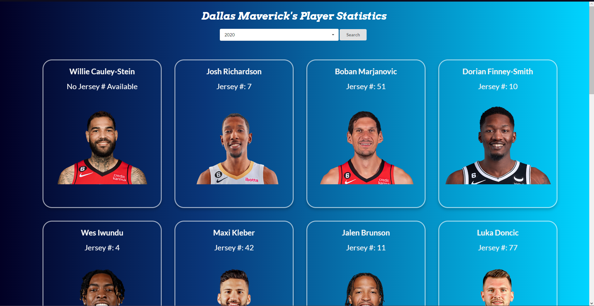

# UTA Project 1

## Description

This Webpage pulls information from the NBA Documentation API to get Dallas Maverick Player statistics for the 2015 - 2022 seasons. Users can select which season they want to get player stats from,
and the webpage will dynamically update and display "cards" of the players on the Dallas Maverick's during that season. 
  
The "cards" are professional headshots of the Players (with images pulled from the Bing Image Search API), and when a user clicks on one of the images it flips over to display the Player's average stats for the season, specifically average points, assists, total rebounds, and FGP. 
  
User's can look at the stats for all the Players displayed on the page, and can then re-select the season they want to see to update the webpage to show the players for that season.

## Technologies Used

[NBA Documentation API](https://rapidapi.com/api-sports/api/api-nba/)  
[Bing Image Search API](https://rapidapi.com/microsoft-azure-org-microsoft-cognitive-services/api/bing-image-search1/)  
[Semantic UI](https://semantic-ui.com/usage/layout.html)  
[Font Joy](https://fontjoy.com)  
[jQuery](https://jqueryui.com/)  

## Usage

When you first load up the page, it will be empty except for the text and the dropdown menu.
After selecting a date and pressing search, the page will fill with cards displaying the player's name,
their jersey number (if available), and a picture of them. If you click on a card it will flip it over,
and some text will appear displaying their average stats for every game they played in that season.
Clicking on the card again will flip it back over. And if you want to look at a different season, you
just need to change the input field and press search again!

Link to the webpage: [Dallas Mavericks Player Stats](https://devonmcfarlen.github.io/DallasMavericksPlayerStats/)

## Authors

[Jae Kim](https://github.com/Jaek23) 
[Devon McFarlen](https://github.com/DevonMcfarlen) 
[Prayusha Pandey](https://github.com/prayushapandey04) 

## License

MIT License